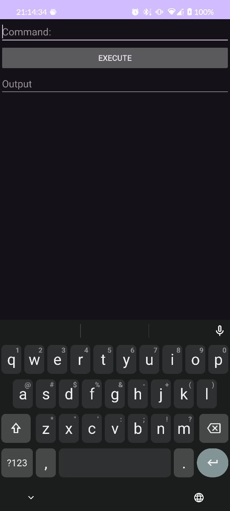

# shizuku-shell

Este é um projeto Android simples que utiliza a biblioteca [Shizuku](https://github.com/RikkaApps/Shizuku/blob/master/README.md) para executar comandos shell com permissões de root. A biblioteca Shizuku permite executar operações privilegiadas sem exigir o acesso root completo no dispositivo Android.

## Funcionalidades

- **Execução de comandos shell com permissões elevadas**: Permite que o aplicativo execute comandos que normalmente exigiriam permissões de root, sem a necessidade de root.
- **Controle de permissões**: O aplicativo verifica e solicita permissões de Shizuku para garantir que o usuário tenha autorização para realizar operações com permissões elevadas.

## Como Usar

- Para usar este aplicativo, é necessário um dispositivo com Android versão 11 ou superior.
- Também é necessário ter o Shizuku instalado e ativo no dispositivo.

## Screenshots

## Tecnologias Usadas

- **Android Studio**: IDE utilizada para o desenvolvimento do aplicativo Android.
- **Kotlin**: Linguagem de programação principal para o desenvolvimento Android.
- **Shizuku**: Biblioteca para acessar o shell com permissões de root de forma segura.